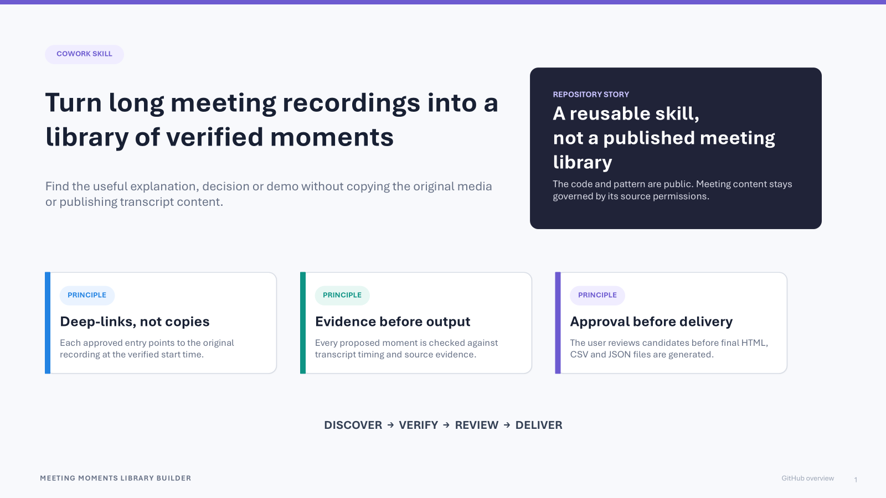
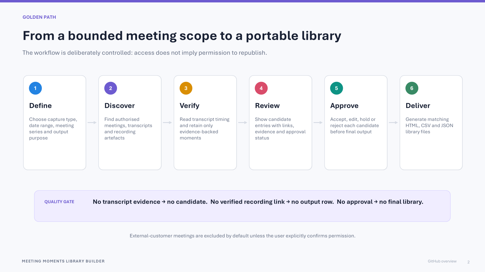
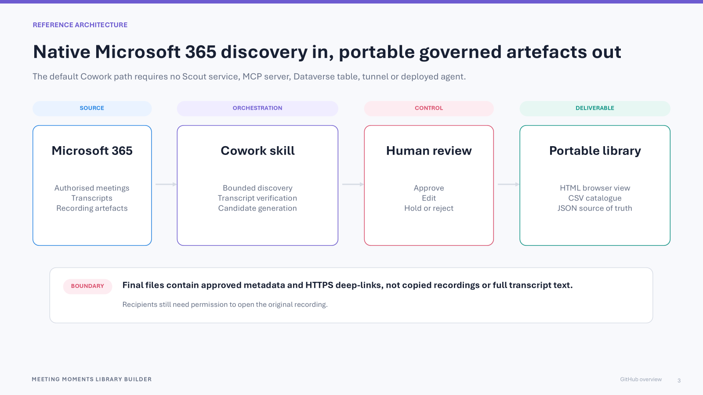
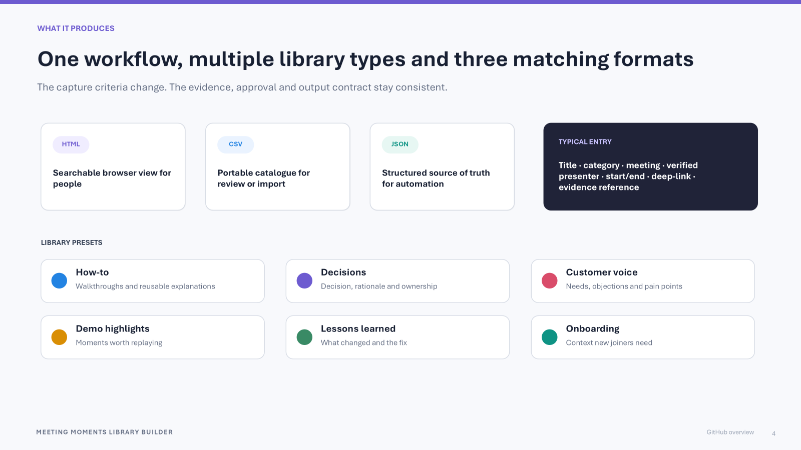

# Meeting Moments Library Builder for Cowork

Turn authorized Microsoft 365 meeting recordings into a searchable video library of the
moments worth keeping.

Cowork finds the meetings you choose, resolves their transcripts and recording files,
identifies useful moments, and asks you to approve them before creating:

- a searchable HTML video library;
- a CSV ready for Microsoft Lists or another system; and
- a JSON source of truth.

Each published entry links to the original recording at its verified timestamp. No video
is copied, cut, or re-hosted.

## Visual overview

The reusable skill and workflow are public; real meeting content and generated libraries
remain subject to their source permissions and the intended audience's approval.

### Golden path

### Reference architecture

### Library outputs

## Download

**[Download Meeting Moments Library Builder for Cowork v1.2.0](https://github.com/SandraBcna/meeting-moments-library-builder-cowork/releases/download/v1.2.0/meeting-moments-library-builder-cowork.zip)**

## Install in Cowork

1. Open **Cowork → Customize → Skills**.
2. Select **Add → Upload skill**.
3. Upload `meeting-moments-library-builder-cowork.zip`.
4. Start a new Cowork task.

## Use

Ask Cowork to search a specific date range and meeting series:

> Build a how-to video library from the Architecture Office Hours meetings in the last
> 30 days.

You can also create:

- a decision library;
- customer-voice highlights;
- demo highlights;
- lessons learned;
- onboarding moments; or
- a library based on custom criteria.

Cowork will:

1. find matching meetings in the date range you approved;
2. resolve the correct transcript and recording file automatically;
3. verify candidate moments against transcript timestamps;
4. show you a review table;
5. wait for your approval; and
6. generate the HTML, CSV, and JSON files.

If a transcript is inaccessible, you may attach `.vtt`, `.srt`, or `.txt` captions.
Recording links are still resolved automatically. Meetings without an accessible
recording are skipped before candidate extraction.

## Requirements

- Microsoft 365 Copilot Cowork with custom skills enabled
- Permission to access the selected meetings, transcripts, and recordings
- Organizational approval to curate and share the selected content

No external server, Dataverse environment, MCP server, tunnel, or separately deployed
agent is required.

## Outputs

| File | Purpose |
|---|---|
| `meeting-moments-library.html` | Searchable video library that opens in a browser |
| `meeting-moments-library.csv` | Import into Microsoft Lists or another data store |
| `meeting-moments-library.json` | Structured source of truth for future updates |

Only approved, transcript-verified moments with a validated HTTPS recording link are
published. Held, rejected, blocked, and needs-review candidates are not included in any
downloadable output.

## Acceptance checklist

- [ ] The skill appears in a new Cowork task
- [ ] The intended meeting series is discovered
- [ ] The correct meeting occurrence and transcript are matched
- [ ] The corresponding recording file is resolved automatically
- [ ] Candidate moments have verified timestamps
- [ ] No presenter or recording link is guessed
- [ ] A review table appears before generation
- [ ] Only approved entries appear in the HTML library
- [ ] HTML, CSV, and JSON outputs are generated successfully

## Privacy and permissions

- Access to a recording does not automatically grant permission to republish it.
- Recording links retain their existing Microsoft 365 permissions.
- Full transcript text is not included in the generated library.
- External-customer content is excluded unless explicitly approved.
- SharePoint or OneDrive publication is optional and requires confirmation.
- Meetings without an automatically resolved recording are skipped.

## Tested release

Version 1.2.0 has been tested in Cowork for meeting discovery, recurring-occurrence
matching, transcript discovery, automatic recording-file resolution, approval gating, and
HTML/CSV/JSON generation.

## Important disclaimer

This community skill is provided **as is** under the [MIT License](LICENSE). It is not
an official Microsoft product, certification, or Microsoft support commitment. A
community-gallery listing does not constitute production approval.

The testing described above is non-production validation, not a guarantee that the
skill will find every meeting or that its output is accurate, secure, compliant,
licensed, or suitable for another organization. Before using or sharing a library,
adopters must verify recording and transcript access, permission to process and share
the content, presenter attribution, recording links, sensitivity and retention rules,
the intended audience, and applicable privacy, security, licensing, and accessibility
requirements. Human review and approval remain required before generating final files.

Do not commit or upload real recordings, transcripts, private links, customer data,
credentials, or generated internal libraries to this public repository. This
disclaimer does not override sensitivity labels or authorize disclosure.

## Security reporting

For potential vulnerabilities in this skill, use GitHub private vulnerability reporting.
For Microsoft product or service vulnerabilities, follow the guidance in
[SECURITY.md](SECURITY.md).
